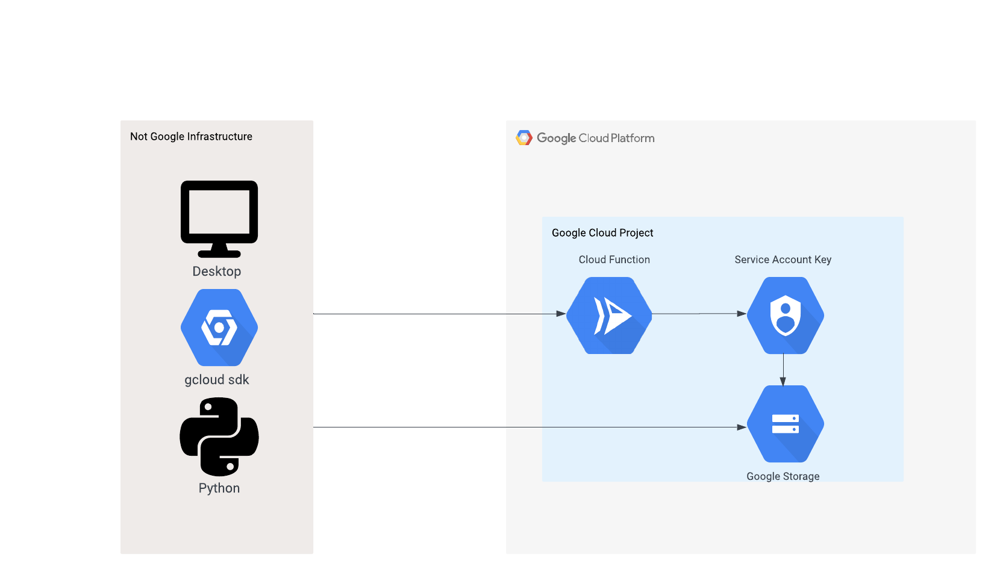

# terraform-google-service-account-keys

This module will deploy a cloud function to act as proxy to manage service account keys with an expiration date. 

## Demo Reference Architecture


## Cloud Function Usage

Basic usage of this module is as follows:

```hcl
module "service_account_keys" {
  source  = "terraform-google-modules/service-account-keys/google"
  version = "~> 0.1"

  project_id  = "<PROJECT ID to create service account keys>"
  identity_running_function ="Google group that will have permission to invoke the cloud function"
}
```
- `terraform init` to get the plugins
- `terraform plan` to see the infrastructure plan
- `terraform apply` to apply the infrastructure build
- `gcloud config set project your_project_id`
- `gcloud functions call key-expiration --data '{"method":"create", "service_account_email":"your_service_account@your_project_id.iam.gserviceaccount.com"}' to create key for service account
- `gcloud functions call key-expiration --data '{"method":"list", "service_account_email":"your_service_account@your_project_id.iam.gserviceaccount.com"}' to list keys for service account
- `gcloud functions call key-expiration --data '{"method":"delete", "full_key_name":"your_full_key_name_path"}' to delete an individual key in list output
- `gcloud functions call key-expiration --data '{"method":"delete_expired_keys", "service_account_email":"your_service_account@your_project_id.iam.gserviceaccount.com"}' to delete all expired keys
- `terraform destroy` to destroy the built infrastructure

##  Developer usage
- `cd ~/terraform-google-service-account-keys/files`
- `./service_account_keys.py create your_service_account@your_project_id.iam.gserviceaccount.com`
- `./service_account_keys.py list your_service_account@your_project_id.iam.gserviceaccount.com`
- `./service_account_keys.py delete full_key_name_path`
- `./service_account_keys.py delete_expired_keys your_service_account@your_project_id.iam.gserviceaccount.com`

<!-- BEGINNING OF PRE-COMMIT-TERRAFORM DOCS HOOK -->
## Inputs

| Name | Description | Type | Default | Required |
|------|-------------|------|---------|:--------:|
| activate\_apis | The list of apis to activate for Cloud Function | `list(string)` | <pre>[<br>  "storage.googleapis.com",<br>  "cloudfunctions.googleapis.com",<br>  "cloudbuild.googleapis.com"<br>]</pre> | no |
| disable\_dependent\_services | Whether services that are enabled and which depend on this service should also be disabled when this service is destroyed. https://www.terraform.io/docs/providers/google/r/google_project_service.html#disable_dependent_services | `string` | `"false"` | no |
| disable\_services\_on\_destroy | Whether project services will be disabled when the resources are destroyed. https://www.terraform.io/docs/providers/google/r/google_project_service.html#disable_on_destroy | `string` | `"false"` | no |
| enable\_apis | Whether to actually enable the APIs. If false, this module is a no-op. | `string` | `"true"` | no |
| environment | Unique environment name to link the deployment together | `string` | `"key-expiration"` | no |
| function\_entry\_point | Name of function in python script | `string` | `"main"` | no |
| identity\_running\_function | Google group that will have permission to invoke the cloud function | `string` | n/a | yes |
| project\_id | Google Cloud Project where Cloud Function will be deployed | `any` | n/a | yes |
| region | Region where cloud function is deployed | `string` | `"us-central1"` | no |
| runtime | Runtime environment for cloud function | `string` | `"python37"` | no |

## Outputs

No output.

<!-- END OF PRE-COMMIT-TERRAFORM DOCS HOOK -->

## Requirements

These sections describe requirements for using this module.

### Software

The following dependencies must be available:

- [Terraform][terraform] v1.30
- [Terraform Provider for GCP][terraform-provider-gcp] plugin v3.0

### Deployment Account

The deployment account with the following roles must be used to provision
the resources of this module:

- Storage Admin: `roles/storage.admin`
- Cloud Function Admin: `roles/cloudfunctions.admin`
- Security Admin: `roles/iam.securityAdmin`

### APIs

A project with the following APIs enabled must be used to host the
resources of this module:

- Cloud Functions API: `cloudfunctions.googleapis.com`
- Google Cloud Storage API: `storage-api.googleapis.com`
- Cloud Build API: `cloudbuild.googleapis.com`
- Pub/Sub: `pubsub.googleapis.com`


## Contributing

Refer to the [contribution guidelines](./CONTRIBUTING.md) for
information on contributing to this module.

[iam-module]: https://registry.terraform.io/modules/terraform-google-modules/iam/google
[project-factory-module]: https://registry.terraform.io/modules/terraform-google-modules/project-factory/google
[terraform-provider-gcp]: https://www.terraform.io/docs/providers/google/index.html
[terraform]: https://www.terraform.io/downloads.html

## Security Disclosures

Please see our [security disclosure process](./SECURITY.md).
